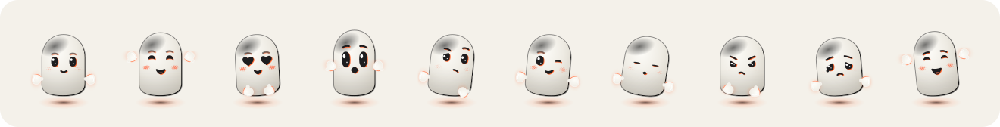
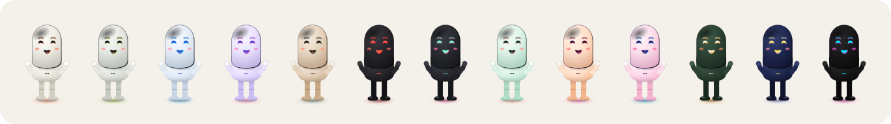
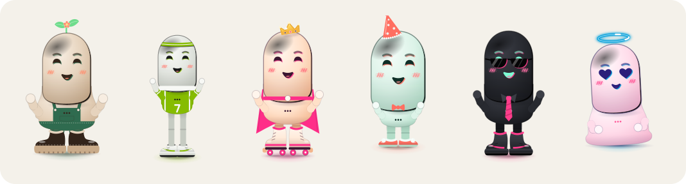

<div align="center">



<br>

**A friendly, animated and highly customizable SVG mascot for Svelte 5.**

A matte, streetwear-styled capsule bot whose face is screen-printed onto its shell, with an
accent plate that never quite lines up and halftone cheeks. It blinks, breathes, follows the
cursor, reacts to boops, switches moods and lip-syncs to your voice.

<br>


[Install](#install) · [Quick start](#quick-start) · [Gallery](#gallery) · [Props](#props) · [Voice](#voice--lip-sync) · [Development](#development)

</div>

---

## Why mascbob?

|                         |                                                                                              |
| ----------------------- | -------------------------------------------------------------------------------------------- |
| 🎭 **Moods that morph** | Every mood is one outline that tweens into the next, so faces morph instead of crossfading.  |
| 👀 **Alive by default** | Blinks, breathes, glances around, follows the cursor and gets bored when you leave it alone. |
| 🫳 **Reacts to you**    | Pet it, boop it, tickle it, pull its limbs like a puppet. Every reaction fires an event.     |
| 🎙️ **Lip-sync**         | Feed it a mic level and it talks along, or let it babble on its own.                         |
| 👟 **Dress it up**      | Sneaker-drop colorways, head shapes, eye styles, builds, outfits, shoes and accessories.     |
| 🪶 **Tiny footprint**   | Pure SVG + CSS. No runtime dependencies besides `svelte`. Respects `prefers-reduced-motion`. |

## Install

```sh
pnpm add mascbob
```

## Quick start

```svelte
<script>
	import { Mascot } from 'mascbob';
	let mood = $state('idle');
</script>

<Mascot {mood} theme="og" onboop={() => (mood = 'love')} />
```

It reacts to the pointer: its head tilts toward the cursor, stroke over its head to pet it, circle around it to make it dizzy,
boop it over and over to tickle it (keep going once it's grumpy and its head bursts into confetti),
grab its head, an arm or a leg and pull it around like a puppet (it stretches like rubber the further you pull and snaps back with a wobble when you let go),
or leave it alone until it gets bored. `follow`, `pet`, `dizzy`, `tickle`, `explode`, `grab` and `bored` are on by
default; `startle` and `shy` are opt-in. A plain click is still a boop; dragging only starts after a few pixels.
The `grab` event carries the `part` (one of `GRAB_PARTS`); in head-only mode (`body={false}`) only the head can be grabbed:

```svelte
<Mascot reactions={['pet', 'shy', 'startle']} onreaction={(e) => console.log(e.type)} />
```

The full figure is 2:3 (`size` is the width). Dress it with `outfit`, `shoes` and `build`, or use `body={false}` for a square head-only avatar:

```svelte
<Mascot outfit="hoodie" shoes="hightops" theme="bred" mood="happy" size={220} />
<Mascot body={false} size={64} />
```

## Gallery

### Moods



`idle` `happy` `love` `surprised` `thinking` `wink` `sleepy` `grumpy` `sad` `laughing`, plus
`listening`, `talking`, `shy`, `waving`, `focused`, `curious` and `nervous`.

### Colorways



`og` `volt` `ice` `lilac` `mocha` `bred` `noir` `mint` `sunset` `bubblegum` `forest` `midnight` `shadow`,
or bring your own palette through `theme` or CSS variables.

### Wardrobe



```svelte
<Mascot theme="mocha" build="chubby" outfit="overalls" shoes="boots" accessories={['sprout']} />
<Mascot theme="noir" outfit="tie" shoes="hightops" accessories={['shades']} />
<Mascot theme="bubblegum" build="blob" mood="love" accessories={['halo']} />
```

## Props

### Creature species and proportions

`species` selects an anatomy: `bob` (the original), `critter` (large ears, paws and a tail),
`moss` (one plant body with leaf arms and roots), `wisp` (a floating spirit with detached hands),
`octo` (a soft bell with four curled tentacles), or `snail` (eye stalks, a spiral house and a soft foot).
They share the same moods, gaze, speech and pointer reactions. Moss and wisp can be grabbed
by their silhouette or hands; bob and critter also have grabbable legs.
Octo's four tentacles stretch independently and curl up when sleepy or sad. Its rear pair
fires `onreaction` with `part: 'arm-left'` / `'arm-right'`; the front pair uses `'leg-left'` / `'leg-right'`.
Snail keeps the shared morphing eyes on its stalks, tucks its head in when shy or sleepy,
and can be grabbed by its head, house or either eye stalk. The stalks fire `onreaction`
with `part: 'arm-left'` / `'arm-right'` and spring back on release. It has no hands or legs.

```svelte
<Mascot species="critter" proportions={{ head: 1.15, legs: 0.8, ears: 1.2 }} theme="mocha" />
<Mascot proportions={{ muscle: 1.6 }} outfit="jersey" />
<Mascot species="moss" proportions={{ body: 1.2, height: 0.85 }} theme="mint" />
<Mascot species="wisp" proportions={{ tail: 1.25 }} theme="lilac" />
<Mascot species="octo" proportions={{ arms: 1.2 }} theme="mocha" accessories={['beanie']} />
<Mascot species="snail" proportions={{ body: 1.2, arms: 0.8 }} theme="mocha" />
```

Proportions are multipliers from `0.4` to `1.8` (default `1`); out-of-range values are clamped.
`head` changes head size, `body` body width, `height` body length, and `arms` and `legs` limb
length. `muscle` bulks up Bob's and Critter's arms and fists and broadens the shoulders a little. `ears` applies to critter; `tail` to critter and wisp. Moss and wisp have no legs:
`head` sizes the upper contour without scaling the face; `arms` sizes leaf arms or detached hands.
For octo, `head` sizes the crown, `body` the bell width, `height` the bell length and `arms` all four tentacles.
For snail, `head` sizes the head contour, `body` the house, `height` the foot length and `arms` the eye stalks.
With `body={false}`, body proportions are ignored; critter retains its adjustable ears.

`shape` selects Bob's head only. `build` still selects Bob or Critter's body proportions before
the multipliers are applied (defaults: `standard` for Bob, `chibi` for Critter). Moss, Wisp, Octo and Snail
always keep their continuous anatomy; `build`, `outfit` and `shoes` do not apply to them.
All species support themes, eye styles and head accessories. Import `SPECIES` for a picker.

The value lists grow over time, so the library exports them. Import `MOODS`, `SHAPES`,
`EYE_STYLES`, `ACCESSORIES`, `OUTFITS`, `SHOES`, `BUILDS` and `THEMES` (an object keyed by theme name) to see
every option or to build your own pickers:

```ts
import { MOODS, SHAPES, EYE_STYLES, ACCESSORIES, OUTFITS, SHOES, BUILDS, THEMES } from 'mascbob';
```

| Prop          | Type                                                                                                               | Default                  |
| ------------- | ------------------------------------------------------------------------------------------------------------------ | ------------------------ |
| `mood`        | one of `MOODS`                                                                                                     | `idle`                   |
| `theme`       | a key of `THEMES`, a `#RRGGBB` body color, or `{ base?, bodyLight, bodyMid, bodyDark, visor, eye, cheek, accent }` | `og`                     |
| `shape`       | one of `SHAPES` (head silhouette)                                                                                  | `capsule`                |
| `eyes`        | one of `EYE_STYLES`                                                                                                | `round`                  |
| `accessories` | array of `ACCESSORIES`                                                                                             | `[]`                     |
| `body`        | full figure with arms and legs, 2:3 (`size` is the width); `false` shows just the head                             | `true`                   |
| `outfit`      | one of `OUTFITS`; only visible with `body`                                                                         | `none`                   |
| `heldItem`    | `none`, `sword`, `microphone` or `phone`; full-body bob and critter                                                | `none`                   |
| `shoes`       | one of `SHOES`; only visible with `body`                                                                           | `none`                   |
| `build`       | one of `BUILDS` (`standard`, `chubby`, `lanky`, `chibi`, `blob`); only visible with `body`                         | `standard`               |
| `hands`       | floating hands that gesture with the mood (head-only mode)                                                         | `true`                   |
| `lookAt`      | `pointer` `wander` `none` or `{ x, y }` in -1..1                                                                   | `pointer`                |
| `level`       | mouth opening 0..1 while `talking` (e.g. mic amplitude); omit for automatic lip movement                           | –                        |
| `size`        | px number or any CSS length                                                                                        | `160`                    |
| `float`       | idle hover animation (head-only mode; the full figure stands)                                                      | `true`                   |
| `effects`     | particles around the head: mood effects (sparkles, hearts, zzz) and boop bursts                                    | `true`                   |
| `motion`      | `auto` (respects `prefers-reduced-motion`), `full`, `reduced`                                                      | `auto`                   |
| `interactive` | render as a button that reacts to clicks                                                                           | `true`                   |
| `reactions`   | pointer reactions: `true` (defaults), `false`, a list of `REACTIONS`, or `{ shy: true, bored: false }`             | `true`                   |
| `grab`        | how grabbing feels: `{ follow, lean }`, `follow` 0..1 (how far the head follows), `lean` 0..3 (body lean)          | `{ follow: 1, lean: 1 }` |
| `label`       | accessible name                                                                                                    | `Mascbob`                |
| `onboop`      | click/tap handler                                                                                                  | –                        |
| `onreaction`  | called with a `ReactionEvent` (`pet`, `startle`, `dizzy`, `shy`, `tickle`, `explode`, `grab`, `bored`, `wake`)     | –                        |
| `accessory`   | snippet `({ top, halfWidth })` drawing custom SVG in the head's 200×200 viewBox                                    | –                        |

`lookAt` also guides a head lean and nod; the default `follow` reaction allows this even outside the mascot.
Bob and Critter move their whole head toward the gaze while their torso follows only a little.
Snail keeps its body and house steady and aims its eye stalks instead. `lookAt="none"` disables
gaze-driven head motion; it also stops with reduced motion and holds its orientation during a drag.

## Styling with CSS

Every color is also a CSS variable, which wins over the `theme` prop:

```css
.brand {
	--mascbob-body-light: #fff;
	--mascbob-body-mid: #ffe1f0;
	--mascbob-body-dark: #ffb3d9;
	--mascbob-visor: #1b1030;
	--mascbob-eye: #00ffc6;
	--mascbob-cheek: #ff7ab8;
	--mascbob-accent: #ff4fd8;
	--mascbob-sprout: #6fdc8c;
}
```

Give bob or critter something to hold with `heldItem`. The sword swings, the microphone
moves while `mood="talking"`, and the phone gently tilts with its screen facing the mascot. Items follow
the hand when you grab an arm; `motion="reduced"` stops their looping movements.
Import `HELD_ITEMS` for a picker. Head-only avatars and other species do not show held items.

```svelte
<Mascot heldItem="sword" outfit="cape" mood="happy" />
<Mascot heldItem="microphone" mood="talking" />
<Mascot heldItem="phone" mood="focused" />
```

## Custom accessories

```svelte
<Mascot>
	{#snippet accessory({ top })}
		<circle cx="100" cy={top - 10} r="8" fill="gold" />
	{/snippet}
</Mascot>
```

## Voice / lip-sync

Set `mood="talking"` and feed an amplitude in 0..1 into `level`. With the Web Audio API
that is a few lines:

```svelte
<script>
	import { Mascot } from 'mascbob';
	let level = $state(0);

	async function listen() {
		const stream = await navigator.mediaDevices.getUserMedia({ audio: true });
		const ctx = new AudioContext();
		const analyser = ctx.createAnalyser();
		ctx.createMediaStreamSource(stream).connect(analyser);
		const samples = new Float32Array(analyser.fftSize);
		const tick = () => {
			analyser.getFloatTimeDomainData(samples);
			const rms = Math.sqrt(samples.reduce((sum, s) => sum + s * s, 0) / samples.length);
			const target = Math.min(1, Math.max(0, (rms - 0.01) * 7));
			// Open fast, close slower, so the mouth doesn't flicker between syllables.
			level += (target - level) * (target > level ? 0.5 : 0.2);
			requestAnimationFrame(tick);
		};
		tick();
	}
</script>

<button onclick={listen}>Talk</button>
<Mascot mood="talking" {level} />
```

Stop the stream's tracks and close the `AudioContext` when you are done. Without `level`,
`talking` animates the mouth on its own.

## Development

- `just` lists all recipes
- `just dev` starts the showcase at http://localhost:5173
- `/world` opens Bob World, a local isometric game prototype with a bot opponent, playable by
  touch or mouse. Tap to walk and walk up to Rumi to challenge it. Duels are flicked in
  simultaneous turns: pull anywhere like a slingshot in one of three strengths, both arrows are
  revealed, then both Bobs slide at once. A dotted path shows where Bob stops if it misses, so a
  full-power miss can carry you out yourself; the ring closes in from turn three, and the first
  one out loses. Tapping fast at the gym builds strength that shows as `muscle` and makes Bob
  heavier. Wins drop capsules with accessories, outfits and
  shoes. Everything is saved in this browser; this prototype has no online connection.
- `just ci` runs type check, lint, tests and the package build
- `just readme-art` re-renders the images in this README from the real component
- `just release` cuts a release

## License

MIT

<div align="center">
<sub>Made with 🧡 and a slightly misaligned print plate.</sub>
</div>
